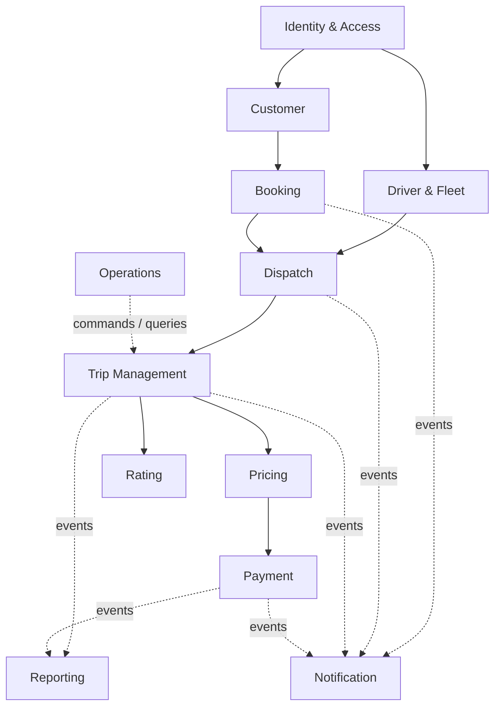

# THIẾT KẾ PHÂN RÃ DOMAIN-DRIVEN DESIGN (DDD) — CAB SYSTEM

## 1. Nguyên tắc phân rã

Mỗi subdomain được đặt trong một **Bounded Context** riêng và phải bảo đảm:

- Có một năng lực nghiệp vụ và ngôn ngữ nghiệp vụ riêng.
- Sở hữu mô hình, quy tắc và dữ liệu của chính nó.
- Không truy cập trực tiếp cơ sở dữ liệu của context khác.
- Chỉ trao đổi bằng API, message hoặc domain event; tham chiếu đối tượng ngoài context bằng ID.
- Có thể thay đổi, triển khai và mở rộng độc lập về mặt logic. DDD không bắt buộc mỗi context phải là một microservice; giai đoạn đầu có thể triển khai dưới dạng modular monolith với schema/module riêng.

## 2. Phân loại subdomain

| Loại | Subdomain | Lý do |
|---|---|---|
| **Core** | Booking | Khởi tạo nhu cầu chuyến đi của khách hàng. |
| **Core** | Dispatch | Thuật toán tìm, mời và phân công tài xế là lợi thế nghiệp vụ chính. |
| **Core** | Trip Management | Quản lý vòng đời thực hiện chuyến đi. |
| **Core** | Pricing | Xác định cước theo dịch vụ và dữ liệu chuyến. |
| **Supporting** | Driver & Fleet | Quản lý tài xế, phương tiện và điều kiện hoạt động. |
| **Supporting** | Payment | Quản lý giao dịch, trạng thái thanh toán và đối soát. |
| **Supporting** | Rating | Quản lý đánh giá sau chuyến. |
| **Supporting** | Operations | Xử lý sự cố và hỗ trợ vận hành. |
| **Supporting** | Reporting | Tổng hợp dữ liệu phục vụ quản trị và kinh doanh. |
| **Generic** | Identity & Access | Xác thực, tài khoản, vai trò và quyền truy cập. |
| **Generic** | Notification | Gửi thông báo đa kênh. |
| **Generic** | Audit | Ghi nhận dấu vết các thao tác quan trọng. |

## 3. Thiết kế từng Bounded Context độc lập

### BC01 — Identity & Access Context

- **Trách nhiệm:** đăng ký, đăng nhập, khóa/mở tài khoản, vai trò và quyền.
- **Sở hữu dữ liệu:** `UserAccount`, `Credential`, `Role`, `Permission`, `Session`.
- **Aggregate Root:** `UserAccount`.
- **Không chịu trách nhiệm:** hồ sơ nghiệp vụ khách hàng, hồ sơ tài xế, phương tiện.
- **Cung cấp:** `UserId`, token/claims và kết quả kiểm tra quyền.
- **Sự kiện:** `UserRegistered`, `UserRoleChanged`, `UserAccountLocked`.
- **Yêu cầu:** FR-01, FR-02, FR-54, FR-55.

### BC02 — Customer Context

- **Trách nhiệm:** quản lý hồ sơ và thông tin liên hệ của khách hàng.
- **Sở hữu dữ liệu:** `CustomerProfile`, `ContactInformation`, `CustomerStatus`.
- **Aggregate Root:** `Customer`.
- **Không chịu trách nhiệm:** mật khẩu, quyền truy cập, chuyến đi hay thanh toán.
- **Tham chiếu ngoài:** `UserId` do Identity cung cấp.
- **Sự kiện:** `CustomerProfileCreated`, `CustomerProfileUpdated`.
- **Yêu cầu:** FR-03 và phần khách hàng của FR-42.

### BC03 — Driver & Fleet Context

- **Trách nhiệm:** hồ sơ tài xế, phương tiện, loại xe, điều kiện đủ chuẩn và trạng thái sẵn sàng nhận chuyến.
- **Sở hữu dữ liệu:** `DriverProfile`, `Vehicle`, `VehicleType`, `DriverAvailability`.
- **Aggregate Root:** `Driver`; `Vehicle` có vòng đời riêng nên có thể là aggregate root thứ hai.
- **Bất biến chính:** tài xế chỉ ở trạng thái `AVAILABLE` khi hồ sơ và phương tiện hợp lệ; một phương tiện không được gắn đồng thời cho nhiều tài xế đang hoạt động nếu chính sách cấm.
- **Không chịu trách nhiệm:** lựa chọn tài xế cho một booking cụ thể.
- **Sự kiện:** `DriverBecameAvailable`, `DriverBecameUnavailable`, `VehicleAssignedToDriver`.
- **Yêu cầu:** FR-04, FR-05, FR-06, FR-43, FR-44, FR-46.

### BC04 — Booking Context

- **Trách nhiệm:** tiếp nhận và kiểm tra yêu cầu đặt xe của khách hàng.
- **Sở hữu dữ liệu:** `BookingRequest`, `PickupPoint`, `Destination`, `RequestedVehicleType`.
- **Aggregate Root:** `BookingRequest`.
- **Trạng thái:** `DRAFT → CONFIRMED → SEARCHING → ASSIGNED/CANCELLED/NO_DRIVER`.
- **Bất biến chính:** điểm đón, điểm đến và loại xe phải hợp lệ trước khi xác nhận; mỗi booking chỉ liên kết tối đa một chuyến được tạo.
- **Không chịu trách nhiệm:** thuật toán chọn tài xế hoặc cập nhật trạng thái hành trình.
- **Sự kiện:** `BookingConfirmed`, `BookingCancelled`, `DriverAssignedToBooking`, `NoDriverFound`.
- **Yêu cầu:** FR-07 đến FR-11.

### BC05 — Dispatch Context

- **Trách nhiệm:** tìm ứng viên, xếp hạng, gửi lời mời và gán đúng một tài xế cho booking.
- **Sở hữu dữ liệu:** `DispatchJob`, `DriverCandidate`, `DriverOffer`, `Assignment`.
- **Aggregate Root:** `DispatchJob`.
- **Bất biến chính:** tại một thời điểm chỉ có một assignment có hiệu lực cho booking; offer hết hạn không thể chấp nhận; từ chối/quá hạn thì chuyển ứng viên kế tiếp.
- **Dữ liệu đầu vào:** snapshot vị trí, trạng thái sẵn sàng và loại phương tiện; không sở hữu hồ sơ tài xế.
- **Sự kiện:** `DriverOfferSent`, `DriverOfferRejected`, `DriverOfferExpired`, `DriverAssigned`, `DispatchFailed`.
- **Yêu cầu:** FR-12 đến FR-18 và FR-19 ở bước phản hồi lời mời.

### BC06 — Trip Management Context

- **Trách nhiệm:** tạo chuyến sau khi điều phối thành công; quản lý trạng thái và theo dõi vị trí trong thời gian chuyến diễn ra.
- **Sở hữu dữ liệu:** `Trip`, `TripStatusHistory`, `LocationSnapshot`, `TripIncidentReference`.
- **Aggregate Root:** `Trip`.
- **Trạng thái hợp lệ:** `ASSIGNED → DRIVER_ARRIVING → DRIVER_ARRIVED → PASSENGER_ON_BOARD → IN_PROGRESS → COMPLETED`; có nhánh `CANCELLED` hoặc `INTERRUPTED`.
- **Bất biến chính:** không được bỏ qua thứ tự trạng thái; chỉ tài xế được gán mới được cập nhật chuyến; chuyến hoàn tất không thể quay lại đang chạy.
- **Không chịu trách nhiệm:** lựa chọn tài xế, tính giá hoặc thu tiền.
- **Sự kiện:** `TripCreated`, `DriverArrived`, `PassengerPickedUp`, `TripStarted`, `TripCompleted`, `TripInterrupted`, `DriverLocationUpdated`.
- **Yêu cầu:** FR-20 đến FR-26, FR-39 và phần chuyến của FR-45.

### BC07 — Pricing Context

- **Trách nhiệm:** quản lý chính sách giá và tạo kết quả tính cước.
- **Sở hữu dữ liệu:** `FarePolicy`, `FareQuote`, `FinalFare`, `Surcharge`, `Discount`.
- **Aggregate Root:** `FarePolicy`; kết quả tính giá là đối tượng bất biến gắn với `TripId`.
- **Bất biến chính:** giá cuối cùng ghi rõ phiên bản chính sách và các thành phần cấu thành; kết quả đã chốt không bị thay đổi khi chính sách mới được ban hành.
- **Không chịu trách nhiệm:** xử lý giao dịch thanh toán.
- **Sự kiện:** `FareEstimated`, `FinalFareCalculated`.
- **Yêu cầu:** FR-27, FR-28 và FR-40.

### BC08 — Payment Context

- **Trách nhiệm:** lựa chọn phương thức, tạo giao dịch, tiếp nhận kết quả từ cổng thanh toán, ghi nhận tiền mặt và đối soát.
- **Sở hữu dữ liệu:** `Payment`, `PaymentTransaction`, `PaymentMethodReference`, `ReconciliationRecord`.
- **Aggregate Root:** `Payment`.
- **Bất biến chính:** callback phải được xử lý idempotent; một khoản thanh toán không thể đồng thời vừa thành công vừa thất bại; không lưu dữ liệu thẻ/tài khoản nhạy cảm.
- **Không chịu trách nhiệm:** tự tính số tiền chuyến; nhận `FinalFare` từ Pricing.
- **Sự kiện:** `PaymentRequested`, `PaymentSucceeded`, `PaymentFailed`, `CashPaymentRecorded`.
- **Yêu cầu:** FR-29 đến FR-32, FR-48, FR-49.

### BC09 — Rating Context

- **Trách nhiệm:** ghi nhận và quản lý đánh giá chuyến/tài xế.
- **Sở hữu dữ liệu:** `TripRating`, `RatingScore`, `RatingComment`.
- **Aggregate Root:** `TripRating`.
- **Bất biến chính:** chỉ khách hàng sở hữu chuyến đã hoàn thành mới được đánh giá; mặc định mỗi chuyến chỉ có một đánh giá.
- **Sự kiện:** `TripRated`.
- **Yêu cầu:** FR-41.

### BC10 — Notification Context

- **Trách nhiệm:** nhận sự kiện, chọn mẫu/kênh, gửi và theo dõi kết quả; hỗ trợ mở rộng SMS, email, push.
- **Sở hữu dữ liệu:** `Notification`, `Template`, `ChannelConfiguration`, `DeliveryAttempt`.
- **Aggregate Root:** `Notification`.
- **Bất biến chính:** event/message trùng lặp không được gửi lặp ngoài chính sách; lỗi gửi không làm rollback nghiệp vụ tạo chuyến hoặc thanh toán.
- **Sự kiện đầu vào:** các sự kiện từ Booking, Dispatch, Trip và Payment.
- **Sự kiện đầu ra:** `NotificationDelivered`, `NotificationFailed`.
- **Yêu cầu:** FR-33 đến FR-38.

### BC11 — Operations Context

- **Trách nhiệm:** tạo case vận hành, phân công nhân viên, ghi nhận xử lý sự cố và thao tác hỗ trợ.
- **Sở hữu dữ liệu:** `OperationalCase`, `Incident`, `CaseAssignment`, `Resolution`.
- **Aggregate Root:** `OperationalCase`.
- **Bất biến chính:** mọi can thiệp vào chuyến phải có lý do, người thực hiện và dấu vết; không chỉnh trực tiếp dữ liệu của context khác.
- **Sự kiện:** `OperationalCaseOpened`, `IncidentResolved`, `TripInterventionRequested`.
- **Yêu cầu:** FR-42 đến FR-47, trong đó màn hình vận hành đọc dữ liệu tổng hợp từ các context liên quan.

### BC12 — Reporting Context

- **Trách nhiệm:** xây dựng read model phục vụ báo cáo số chuyến, doanh thu, tỷ lệ hoàn thành/hủy và hiệu suất tài xế.
- **Sở hữu dữ liệu:** các bảng tổng hợp/projection; không sở hữu dữ liệu giao dịch gốc.
- **Mô hình:** CQRS read model, cập nhật từ domain event.
- **Bất biến chính:** chỉ đọc; không dùng báo cáo để cập nhật ngược dữ liệu nghiệp vụ.
- **Sự kiện đầu vào:** `TripCompleted`, `TripCancelled`, `PaymentSucceeded`, `TripRated` và các sự kiện tài xế.
- **Yêu cầu:** FR-50 đến FR-53.

### BC13 — Audit Context

- **Trách nhiệm:** lưu dấu vết bất biến cho đăng nhập, thay đổi quyền và thao tác quản trị quan trọng.
- **Sở hữu dữ liệu:** `AuditEntry`, `ActorSnapshot`, `Action`, `TargetReference`, `OccurredAt`.
- **Bất biến chính:** bản ghi đã tạo không được chỉnh sửa bởi người dùng nghiệp vụ.
- **Sự kiện đầu vào:** sự kiện bảo mật/quản trị từ các context.
- **Yêu cầu:** FR-56, FR-57. Việc mã hóa và bảo vệ dữ liệu vẫn là yêu cầu xuyên suốt áp dụng cho mọi context.

## 4. Context Map



Các mũi tên thể hiện quan hệ **upstream → downstream**. Downstream chỉ nhận contract công khai, không import entity hoặc truy vấn bảng của upstream.

## 5. Luồng nghiệp vụ chính giữa các context

1. Booking phát `BookingConfirmed`.
2. Dispatch tạo `DispatchJob`, lấy các ứng viên đủ điều kiện từ Driver & Fleet và gửi offer.
3. Khi tài xế chấp nhận, Dispatch phát `DriverAssigned`.
4. Trip Management tạo `Trip` từ sự kiện trên và quản lý toàn bộ vòng đời chuyến.
5. Khi chuyến hoàn tất, Trip phát `TripCompleted` kèm dữ liệu cần thiết để tính tiền.
6. Pricing tính và phát `FinalFareCalculated`.
7. Payment tạo khoản thanh toán, xử lý tiền mặt hoặc tích hợp cổng thanh toán.
8. Notification lắng nghe sự kiện để gửi thông tin; Reporting lắng nghe sự kiện để cập nhật báo cáo; Rating mở quyền đánh giá sau khi nhận `TripCompleted`.

## 6. Quy tắc bảo đảm tính độc lập

| Quy tắc | Cách áp dụng cho CAB System |
|---|---|
| Quyền sở hữu dữ liệu | Mỗi context có schema/database logic riêng; không dùng khóa ngoại xuyên context. |
| Định danh | Chỉ lưu `CustomerId`, `DriverId`, `BookingId`, `TripId`, `PaymentId`; không sao chép toàn bộ entity ngoài context. |
| Tích hợp đồng bộ | Chỉ dùng cho truy vấn cần phản hồi ngay, qua API contract có version. |
| Tích hợp bất đồng bộ | Dùng domain/integration event cho thông báo, báo cáo và chuỗi xử lý đặt xe. |
| Chống lỗi lan truyền | Timeout, retry có giới hạn, circuit breaker và dead-letter queue cho tích hợp ngoài. |
| Chống xử lý trùng | Mỗi consumer lưu `EventId`; Payment và Notification bắt buộc idempotent. |
| Nhất quán | Nhất quán mạnh bên trong aggregate; nhất quán cuối cùng giữa các context. |
| Không chia sẻ domain model | Mỗi context tự định nghĩa model; dùng DTO/event contract tại biên. |
| Không giao dịch phân tán | Dùng Saga/Process Manager cho luồng Booking → Dispatch → Trip → Pricing → Payment. |

## 7. Hiệu chỉnh so với README hiện tại

- Tách **tài khoản** khỏi **hồ sơ khách hàng/tài xế** vì xác thực không cùng mô hình nghiệp vụ với hồ sơ.
- Tách **cước phí** khỏi **thanh toán** vì tính số tiền và thu tiền có quy tắc, vòng đời khác nhau.
- Tách **lịch sử chuyến** khỏi Rating: lịch sử là read model lấy từ Trip/Payment, không phải domain sở hữu chuyến.
- Tách **giao dịch** khỏi Reporting: Payment sở hữu giao dịch; Reporting chỉ lưu bản chiếu tổng hợp.
- “Quản lý vận hành” không được trở thành context bao trùm rồi sở hữu lại khách hàng, tài xế và chuyến. Nó chỉ sở hữu case/sự cố và gửi lệnh hợp lệ tới context chủ quản.
- “Bảo mật dữ liệu” là yêu cầu xuyên suốt; Identity & Access sở hữu xác thực/phân quyền, Audit sở hữu log kiểm toán.

## 8. Cấu trúc triển khai đề xuất

```text
cab-system/
├── identity-access/
├── customer/
├── driver-fleet/
├── booking/
├── dispatch/
├── trip-management/
├── pricing/
├── payment/
├── rating/
├── notification/
├── operations/
├── reporting/
└── audit/
```

Mỗi module nên có các lớp `domain`, `application`, `infrastructure`, `interfaces`. Có thể triển khai chung một ứng dụng ở giai đoạn đầu, nhưng phải giữ ranh giới module và quyền sở hữu dữ liệu để có thể tách thành microservice khi cần.

## 9. Kết luận

CAB System nên được phân thành **13 bounded contexts**. Trong đó Booking, Dispatch, Trip Management và Pricing là phần lõi; các context còn lại hỗ trợ hoặc cung cấp năng lực dùng chung. Thiết kế này làm rõ trách nhiệm, tránh dùng chung mô hình và cho phép từng phần thay đổi độc lập mà không phá vỡ toàn hệ thống.
