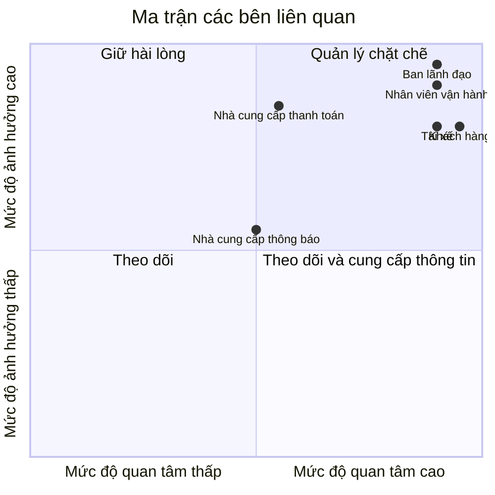
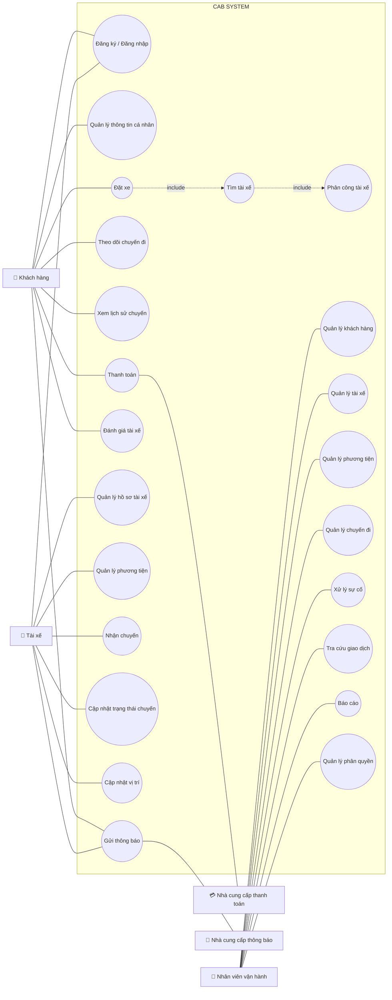

# 23651321_PhanDaiDuong_cabsystem

# CAB System – Phân tích nghiệp vụ

## 1. Hệ thống hiện tại có những vấn đề gì?

* Phân công tài xế chủ yếu thực hiện thủ công.
* Khách hàng khó theo dõi trạng thái chuyến đi.
* Thông tin thanh toán chưa được quản lý tập trung.
* Bộ phận vận hành khó mở rộng hệ thống khi số lượng khách hàng và tài xế tăng.

## 2. Mục tiêu của hệ thống

Xây dựng một nền tảng CAB mới nhằm:

* Hỗ trợ số lượng lớn khách hàng và tài xế.
* Tự động hỗ trợ tìm kiếm và phân công tài xế.
* Cho phép khách hàng theo dõi chuyến đi.
* Quản lý thanh toán và thông tin giao dịch tập trung.
* Có khả năng mở rộng và bổ sung chức năng trong tương lai.

## 3. Người tham gia sử dụng hệ thống

| Người tham gia     | Vai trò                                              |
| ------------------ | ---------------------------------------------------- |
| Khách hàng         | Đặt xe, theo dõi chuyến, thanh toán, đánh giá tài xế |
| Tài xế             | Nhận chuyến, thực hiện chuyến, cập nhật trạng thái   |
| Nhân viên vận hành | Quản lý khách hàng, tài xế, phương tiện và chuyến đi |

## 4. Vấn đề của hệ thống

| Vấn đề                    | Mô tả                                                   |
| ------------------------- | ------------------------------------------------------- |
| Phân công tài xế thủ công | Mất thời gian, khó xử lý khi có nhiều yêu cầu           |
| Khó theo dõi chuyến       | Khách hàng không nắm rõ tài xế và trạng thái chuyến     |
| Thanh toán phân tán       | Khó quản lý tập trung thông tin thanh toán              |
| Khó mở rộng               | Hệ thống hiện tại khó đáp ứng khi lượng người dùng tăng |

B2
 Các bên liên quan (Stakeholder)

| Tên                     | Vai trò                                                               |
| ----------------------- | --------------------------------------------------------------------- |
| Khách hàng              | Đặt xe, theo dõi chuyến đi, thanh toán và đánh giá tài xế             |
| Tài xế                  | Nhận chuyến, thực hiện chuyến và cập nhật trạng thái chuyến           |
| Nhân viên vận hành      | Quản lý khách hàng, tài xế, phương tiện và chuyến đi; xử lý các sự cố |
| Ban lãnh đạo            | Theo dõi báo cáo về số lượng chuyến, doanh thu và hiệu quả hoạt động  |
| Nhà cung cấp thanh toán | Xử lý các giao dịch thanh toán điện tử                                |
| Nhà cung cấp thông báo  | Cung cấp các kênh gửi thông báo cho khách hàng và tài xế              |

## Ma trận các bên liên quan

| Bên liên quan | Mức độ ảnh hưởng | Mức độ quan tâm | Chiến lược |
|---|---|---|---|
| **Ban lãnh đạo** | Cao | Cao | Quản lý chặt chẽ |
| **Nhân viên vận hành** | Cao | Cao | Quản lý chặt chẽ |
| **Khách hàng** | Cao | Cao | Quản lý chặt chẽ |
| **Tài xế** | Cao | Cao | Quản lý chặt chẽ |
| **Nhà cung cấp thanh toán** | Cao | Trung bình | Giữ hài lòng |
| **Nhà cung cấp thông báo** | Trung bình | Trung bình | Theo dõi và phối hợp |

### Phân loại Stakeholder

B3 Mục đích của nghiệp vụ

Mục đích của nghiệp vụ trong hệ thống CAB là:

Quản lý quy trình đặt xe từ khi khách hàng tạo yêu cầu đến khi hoàn thành chuyến.
Tìm kiếm và phân công tài xế phù hợp, ưu tiên tài xế gần khách hàng.
Theo dõi trạng thái chuyến đi và cung cấp thông tin cho khách hàng, tài xế.
Tính cước và quản lý thanh toán cho các chuyến xe.
Quản lý thông tin khách hàng, tài xế, phương tiện và chuyến đi tập trung.
Hỗ trợ nhân viên vận hành theo dõi, xử lý các trường hợp phát sinh.
Cung cấp dữ liệu và báo cáo để ban lãnh đạo theo dõi hoạt động kinh doanh.
Xây dựng hệ thống ổn định, bảo mật và có khả năng mở rộng trong tương lai

B4 Xác định phạm vi cần làm cho dự án trong 7 tuần
| Phạm vi                    | Nội dung cần thực hiện                                                                    |
| -------------------------- | ----------------------------------------------------------------------------------------- |
| **Quản lý tài khoản**      | Đăng ký, đăng nhập, cập nhật thông tin khách hàng và tài xế                               |
| **Đặt xe**                 | Nhập điểm đón, điểm đến, chọn loại xe và gửi yêu cầu                                      |
| **Tìm & phân công tài xế** | Tìm tài xế phù hợp dựa trên vị trí và trạng thái; xử lý trường hợp từ chối/không phản hồi |
| **Quản lý chuyến đi**      | Tài xế nhận chuyến, cập nhật trạng thái; khách hàng theo dõi chuyến                       |
| **Tính cước & thanh toán** | Tính số tiền phải trả, hỗ trợ tiền mặt và thanh toán điện tử                              |
| **Thông báo**              | Thông báo đặt xe, tài xế nhận chuyến, tài xế đến, hoàn thành chuyến và kết quả thanh toán |
| **Quản trị vận hành**      | Quản lý khách hàng, tài xế, phương tiện và chuyến đi; xử lý sự cố                         |
| **Báo cáo**                | Số lượng chuyến, doanh thu, tỷ lệ hoàn thành, tỷ lệ hủy và hiệu quả tài xế                |
| **Bảo mật**                | Xác thực người dùng, phân quyền quản trị và bảo vệ dữ liệu                                |
| **Kiểm thử & triển khai**  | Kiểm thử các nghiệp vụ chính, xử lý lỗi và triển khai hệ thống                            |

| Tuần       | Công việc                                               |
| ---------- | ------------------------------------------------------- |
| **Tuần 1** | Phân tích nghiệp vụ, stakeholder, phạm vi và yêu cầu    |
| **Tuần 2** | Thiết kế Use Case, quy trình nghiệp vụ và cơ sở dữ liệu |
| **Tuần 3** | Xây dựng quản lý tài khoản + đặt xe                     |
| **Tuần 4** | Xây dựng tìm/phân công tài xế + quản lý chuyến          |
| **Tuần 5** | Tính cước, thanh toán + thông báo                       |
| **Tuần 6** | Quản trị vận hành + báo cáo + phân quyền                |
| **Tuần 7** | Tích hợp, kiểm thử, sửa lỗi và triển khai               |

 B5 chuyển các yêu cầu thành các yêu cầu nghiệp vụ (bussiness requiment)
 | Mã        | Business Requirement                                                            |
| --------- | ------------------------------------------------------------------------------- |
| **BR-01** | Cung cấp nền tảng đặt xe trực tuyến cho khách hàng.                             |
| **BR-02** | Tự động tìm kiếm và phân công tài xế phù hợp.                                   |
| **BR-03** | Cho phép khách hàng theo dõi trạng thái chuyến đi.                              |
| **BR-04** | Quản lý toàn bộ thông tin và trạng thái chuyến xe.                              |
| **BR-05** | Hỗ trợ tính cước và thanh toán.                                                 |
| **BR-06** | Hỗ trợ nhân viên vận hành quản lý khách hàng, tài xế, phương tiện và chuyến đi. |
| **BR-07** | Cung cấp thông báo và dữ liệu cần thiết cho các bên liên quan.                  |
| **BR-08** | Đảm bảo bảo mật và khả năng mở rộng của hệ thống.                               |

b6 phân rã ra các yêu cầu chức năng
1. BR-01 – Đặt xe
   
| Mã      | Yêu cầu chức năng                     |
| ------- | ------------------------------------- |
| FR-01.1 | Khách hàng đăng ký tài khoản          |
| FR-01.2 | Khách hàng đăng nhập hệ thống         |
| FR-01.3 | Khách hàng cập nhật thông tin cá nhân |
| FR-01.4 | Khách hàng nhập điểm đón và điểm đến  |
| FR-01.5 | Khách hàng lựa chọn loại xe           |
| FR-01.6 | Khách hàng gửi yêu cầu đặt xe         |

2. BR-02 – Tìm và phân công tài xế

| Mã      | Yêu cầu chức năng                                               |
| ------- | --------------------------------------------------------------- |
| FR-02.1 | Hệ thống xác định các tài xế phù hợp                            |
| FR-02.2 | Hệ thống xác định vị trí và trạng thái sẵn sàng của tài xế      |
| FR-02.3 | Hệ thống ưu tiên tài xế phù hợp và gần khách hàng               |
| FR-02.4 | Tài xế nhận thông báo yêu cầu chuyến                            |
| FR-02.5 | Tài xế chấp nhận hoặc từ chối chuyến                            |
| FR-02.6 | Hệ thống tiếp tục tìm tài xế khác khi bị từ chối/không phản hồi |
| FR-02.7 | Hệ thống thông báo cho khách hàng khi không tìm được tài xế     |

3. BR-03 – Quản lý và theo dõi chuyến đi

| Mã      | Yêu cầu chức năng                           |
| ------- | ------------------------------------------- |
| FR-03.1 | Tài xế cập nhật trạng thái chuyến           |
| FR-03.2 | Hệ thống ghi nhận vị trí của tài xế         |
| FR-03.3 | Khách hàng xem tài xế đã nhận chuyến        |
| FR-03.4 | Khách hàng xem thời gian dự kiến tài xế đến |
| FR-03.5 | Khách hàng theo dõi trạng thái chuyến       |
| FR-03.6 | Khách hàng xem lịch sử chuyến đi            |

4. BR-04 – Tính cước và thanh toán

| Mã      | Yêu cầu chức năng                                         |
| ------- | --------------------------------------------------------- |
| FR-04.1 | Hệ thống xác định số tiền khách hàng phải trả             |
| FR-04.2 | Khách hàng lựa chọn phương thức thanh toán                |
| FR-04.3 | Hỗ trợ thanh toán tiền mặt                                |
| FR-04.4 | Hỗ trợ thanh toán điện tử                                 |
| FR-04.5 | Hệ thống gửi yêu cầu đến nhà cung cấp thanh toán          |
| FR-04.6 | Hệ thống nhận kết quả giao dịch                           |
| FR-04.7 | Thông báo khi thanh toán thất bại                         |
| FR-04.8 | Cho phép xử lý lại giao dịch theo chính sách doanh nghiệp |

5. BR-05 – Thông báo
   
| Mã      | Yêu cầu chức năng                           |
| ------- | ------------------------------------------- |
| FR-05.1 | Thông báo khi yêu cầu đặt xe được tiếp nhận |
| FR-05.2 | Thông báo khi tài xế nhận chuyến            |
| FR-05.3 | Thông báo khi tài xế đến điểm đón           |
| FR-05.4 | Thông báo khi chuyến hoàn thành             |
| FR-05.5 | Thông báo kết quả thanh toán                |
| FR-05.6 | Thông báo chuyến mới cho tài xế             |
| FR-05.7 | Thông báo thay đổi liên quan đến chuyến     |

6. BR-06 – Quản lý vận hành

| Mã      | Yêu cầu chức năng                     |
| ------- | ------------------------------------- |
| FR-06.1 | Nhân viên quản lý khách hàng          |
| FR-06.2 | Nhân viên quản lý tài xế              |
| FR-06.3 | Nhân viên quản lý phương tiện         |
| FR-06.4 | Nhân viên quản lý chuyến đi           |
| FR-06.5 | Nhân viên xem các chuyến đang diễn ra |
| FR-06.6 | Nhân viên kiểm tra trạng thái tài xế  |
| FR-06.7 | Nhân viên xử lý chuyến bị lỗi         |
| FR-06.8 | Nhân viên tra cứu lịch sử giao dịch   |

7. BR-07 – Báo cáo và quản trị

| Mã      | Yêu cầu chức năng                               |
| ------- | ----------------------------------------------- |
| FR-07.1 | Hệ thống cung cấp báo cáo số lượng chuyến       |
| FR-07.2 | Hệ thống cung cấp báo cáo doanh thu             |
| FR-07.3 | Hệ thống cung cấp tỷ lệ chuyến hoàn thành       |
| FR-07.4 | Hệ thống cung cấp tỷ lệ chuyến hủy              |
| FR-07.5 | Hệ thống cung cấp hiệu quả hoạt động của tài xế |
| FR-07.6 | Hệ thống phân quyền các chức năng quản trị      |

8. BR-08 – Bảo mật

| Mã      | Yêu cầu chức năng                                                           |
| ------- | --------------------------------------------------------------------------- |
| FR-08.1 | Xác thực khách hàng và tài xế trước khi sử dụng chức năng yêu cầu tài khoản |
| FR-08.2 | Kiểm soát quyền truy cập chức năng quản trị                                 |
| FR-08.3 | Bảo vệ thông tin cá nhân                                                    |
| FR-08.4 | Bảo vệ thông tin phương tiện                                                |
| FR-08.5 | Bảo vệ dữ liệu vị trí                                                       |
| FR-08.6 | Bảo vệ dữ liệu giao dịch                                                    |
| FR-08.7 | Lưu vết các thao tác quan trọng                                             |

b7 tiến hành vẽ usecase

b8 đặt tả usecase
b9 phân tích qui trình nghiệp vụ 
b10 phân tích các quy tắt, nghiệp vụ
