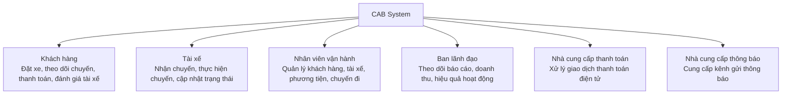

# 23651321_PhanDaiDuong_cabsystem

# CAB System – Phân tích nghiệp vụ

## 1. Hệ thống hiện tại có những vấn đề gì?

* Phân công tài xế chủ yếu thực hiện thủ công.
* Khách hàng khó theo dõi trạng thái chuyến đi.
* Thông tin thanh toán chưa được quản lý tập trung.
* Bộ phận vận hành khó mở rộng hệ thống khi số lượng khách hàng và tài xế tăng.

## 2. Mục tiêu của hệ thống

Xây dựng một nền tảng CAB mới nhằm:

* Hỗ trợ số lượng lớn khách hàng và tài xế.
* Tự động hỗ trợ tìm kiếm và phân công tài xế.
* Cho phép khách hàng theo dõi chuyến đi.
* Quản lý thanh toán và thông tin giao dịch tập trung.
* Có khả năng mở rộng và bổ sung chức năng trong tương lai.

## 3. Người tham gia sử dụng hệ thống

| Người tham gia     | Vai trò                                              |
| ------------------ | ---------------------------------------------------- |
| Khách hàng         | Đặt xe, theo dõi chuyến, thanh toán, đánh giá tài xế |
| Tài xế             | Nhận chuyến, thực hiện chuyến, cập nhật trạng thái   |
| Nhân viên vận hành | Quản lý khách hàng, tài xế, phương tiện và chuyến đi |

## 4. Vấn đề của hệ thống

| Vấn đề                    | Mô tả                                                   |
| ------------------------- | ------------------------------------------------------- |
| Phân công tài xế thủ công | Mất thời gian, khó xử lý khi có nhiều yêu cầu           |
| Khó theo dõi chuyến       | Khách hàng không nắm rõ tài xế và trạng thái chuyến     |
| Thanh toán phân tán       | Khó quản lý tập trung thông tin thanh toán              |
| Khó mở rộng               | Hệ thống hiện tại khó đáp ứng khi lượng người dùng tăng |

## 5. Các bên liên quan (Stakeholder)

| Tên                     | Vai trò                                                               |
| ----------------------- | --------------------------------------------------------------------- |
| Khách hàng              | Đặt xe, theo dõi chuyến đi, thanh toán và đánh giá tài xế             |
| Tài xế                  | Nhận chuyến, thực hiện chuyến và cập nhật trạng thái chuyến           |
| Nhân viên vận hành      | Quản lý khách hàng, tài xế, phương tiện và chuyến đi; xử lý các sự cố |
| Ban lãnh đạo            | Theo dõi báo cáo về số lượng chuyến, doanh thu và hiệu quả hoạt động  |
| Nhà cung cấp thanh toán | Xử lý các giao dịch thanh toán điện tử                                |
| Nhà cung cấp thông báo  | Cung cấp các kênh gửi thông báo cho khách hàng và tài xế              |

