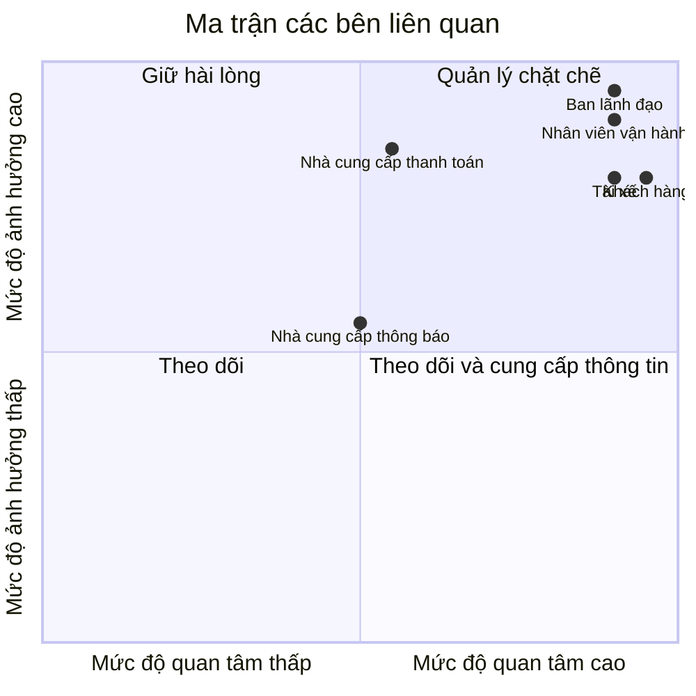

# 23651321_PhanDaiDuong_cabsystem

# CAB System – Phân tích nghiệp vụ

## 1. Hệ thống hiện tại có những vấn đề gì?

* Phân công tài xế chủ yếu thực hiện thủ công.
* Khách hàng khó theo dõi trạng thái chuyến đi.
* Thông tin thanh toán chưa được quản lý tập trung.
* Bộ phận vận hành khó mở rộng hệ thống khi số lượng khách hàng và tài xế tăng.

## 2. Mục tiêu của hệ thống

Xây dựng một nền tảng CAB mới nhằm:

* Hỗ trợ số lượng lớn khách hàng và tài xế.
* Tự động hỗ trợ tìm kiếm và phân công tài xế.
* Cho phép khách hàng theo dõi chuyến đi.
* Quản lý thanh toán và thông tin giao dịch tập trung.
* Có khả năng mở rộng và bổ sung chức năng trong tương lai.

## 3. Người tham gia sử dụng hệ thống

| Người tham gia     | Vai trò                                              |
| ------------------ | ---------------------------------------------------- |
| Khách hàng         | Đặt xe, theo dõi chuyến, thanh toán, đánh giá tài xế |
| Tài xế             | Nhận chuyến, thực hiện chuyến, cập nhật trạng thái   |
| Nhân viên vận hành | Quản lý khách hàng, tài xế, phương tiện và chuyến đi |

## 4. Vấn đề của hệ thống

| Vấn đề                    | Mô tả                                                   |
| ------------------------- | ------------------------------------------------------- |
| Phân công tài xế thủ công | Mất thời gian, khó xử lý khi có nhiều yêu cầu           |
| Khó theo dõi chuyến       | Khách hàng không nắm rõ tài xế và trạng thái chuyến     |
| Thanh toán phân tán       | Khó quản lý tập trung thông tin thanh toán              |
| Khó mở rộng               | Hệ thống hiện tại khó đáp ứng khi lượng người dùng tăng |

B2
 Các bên liên quan (Stakeholder)

| Tên                     | Vai trò                                                               |
| ----------------------- | --------------------------------------------------------------------- |
| Khách hàng              | Đặt xe, theo dõi chuyến đi, thanh toán và đánh giá tài xế             |
| Tài xế                  | Nhận chuyến, thực hiện chuyến và cập nhật trạng thái chuyến           |
| Nhân viên vận hành      | Quản lý khách hàng, tài xế, phương tiện và chuyến đi; xử lý các sự cố |
| Ban lãnh đạo            | Theo dõi báo cáo về số lượng chuyến, doanh thu và hiệu quả hoạt động  |
| Nhà cung cấp thanh toán | Xử lý các giao dịch thanh toán điện tử                                |
| Nhà cung cấp thông báo  | Cung cấp các kênh gửi thông báo cho khách hàng và tài xế              |

## Ma trận các bên liên quan

| Bên liên quan | Mức độ ảnh hưởng | Mức độ quan tâm | Chiến lược |
|---|---|---|---|
| **Ban lãnh đạo** | Cao | Cao | Quản lý chặt chẽ |
| **Nhân viên vận hành** | Cao | Cao | Quản lý chặt chẽ |
| **Khách hàng** | Cao | Cao | Quản lý chặt chẽ |
| **Tài xế** | Cao | Cao | Quản lý chặt chẽ |
| **Nhà cung cấp thanh toán** | Cao | Trung bình | Giữ hài lòng |
| **Nhà cung cấp thông báo** | Trung bình | Trung bình | Theo dõi và phối hợp |

### Phân loại Stakeholder

B3 Mục đích của nghiệp vụ

Mục đích của nghiệp vụ trong hệ thống CAB là:

Quản lý quy trình đặt xe từ khi khách hàng tạo yêu cầu đến khi hoàn thành chuyến.
Tìm kiếm và phân công tài xế phù hợp, ưu tiên tài xế gần khách hàng.
Theo dõi trạng thái chuyến đi và cung cấp thông tin cho khách hàng, tài xế.
Tính cước và quản lý thanh toán cho các chuyến xe.
Quản lý thông tin khách hàng, tài xế, phương tiện và chuyến đi tập trung.
Hỗ trợ nhân viên vận hành theo dõi, xử lý các trường hợp phát sinh.
Cung cấp dữ liệu và báo cáo để ban lãnh đạo theo dõi hoạt động kinh doanh.
Xây dựng hệ thống ổn định, bảo mật và có khả năng mở rộng trong tương lai

B4 Xác định phạm vi cần làm cho dự án trong 7 tuần
| Phạm vi                    | Nội dung cần thực hiện                                                                    |
| -------------------------- | ----------------------------------------------------------------------------------------- |
| **Quản lý tài khoản**      | Đăng ký, đăng nhập, cập nhật thông tin khách hàng và tài xế                               |
| **Đặt xe**                 | Nhập điểm đón, điểm đến, chọn loại xe và gửi yêu cầu                                      |
| **Tìm & phân công tài xế** | Tìm tài xế phù hợp dựa trên vị trí và trạng thái; xử lý trường hợp từ chối/không phản hồi |
| **Quản lý chuyến đi**      | Tài xế nhận chuyến, cập nhật trạng thái; khách hàng theo dõi chuyến                       |
| **Tính cước & thanh toán** | Tính số tiền phải trả, hỗ trợ tiền mặt và thanh toán điện tử                              |
| **Thông báo**              | Thông báo đặt xe, tài xế nhận chuyến, tài xế đến, hoàn thành chuyến và kết quả thanh toán |
| **Quản trị vận hành**      | Quản lý khách hàng, tài xế, phương tiện và chuyến đi; xử lý sự cố                         |
| **Báo cáo**                | Số lượng chuyến, doanh thu, tỷ lệ hoàn thành, tỷ lệ hủy và hiệu quả tài xế                |
| **Bảo mật**                | Xác thực người dùng, phân quyền quản trị và bảo vệ dữ liệu                                |
| **Kiểm thử & triển khai**  | Kiểm thử các nghiệp vụ chính, xử lý lỗi và triển khai hệ thống                            |

| Tuần       | Công việc                                               |
| ---------- | ------------------------------------------------------- |
| **Tuần 1** | Phân tích nghiệp vụ, stakeholder, phạm vi và yêu cầu    |
| **Tuần 2** | Thiết kế Use Case, quy trình nghiệp vụ và cơ sở dữ liệu |
| **Tuần 3** | Xây dựng quản lý tài khoản + đặt xe                     |
| **Tuần 4** | Xây dựng tìm/phân công tài xế + quản lý chuyến          |
| **Tuần 5** | Tính cước, thanh toán + thông báo                       |
| **Tuần 6** | Quản trị vận hành + báo cáo + phân quyền                |
| **Tuần 7** | Tích hợp, kiểm thử, sửa lỗi và triển khai               |

 B5 chuyển các yêu cầu thành các yêu cầu nghiệp vụ (bussiness requiment)
 | Mã        | Business Requirement                                                            |
| --------- | ------------------------------------------------------------------------------- |
| **BR-01** | Cung cấp nền tảng đặt xe trực tuyến cho khách hàng.                             |
| **BR-02** | Tự động tìm kiếm và phân công tài xế phù hợp.                                   |
| **BR-03** | Cho phép khách hàng theo dõi trạng thái chuyến đi.                              |
| **BR-04** | Quản lý toàn bộ thông tin và trạng thái chuyến xe.                              |
| **BR-05** | Hỗ trợ tính cước và thanh toán.                                                 |
| **BR-06** | Hỗ trợ nhân viên vận hành quản lý khách hàng, tài xế, phương tiện và chuyến đi. |
| **BR-07** | Cung cấp thông báo và dữ liệu cần thiết cho các bên liên quan.                  |
| **BR-08** | Đảm bảo bảo mật và khả năng mở rộng của hệ thống.                               |
