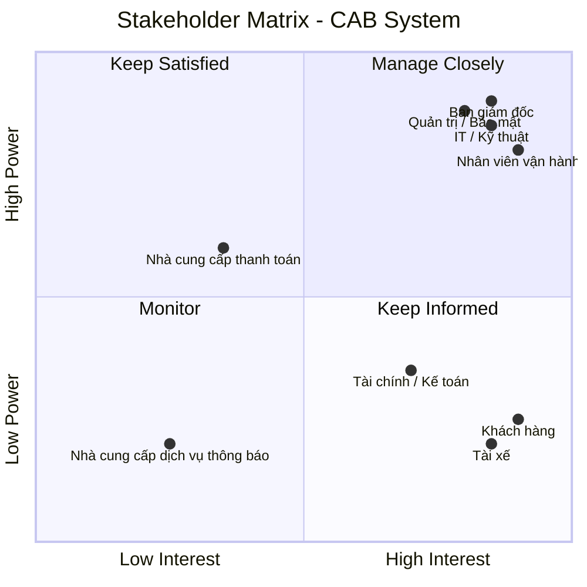
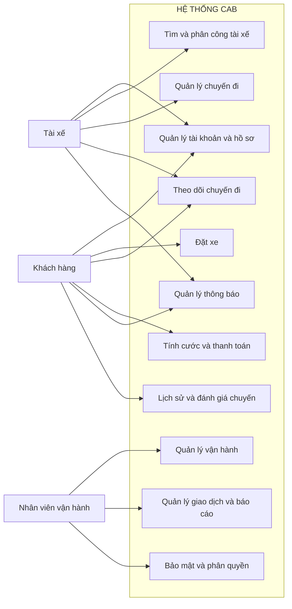

# 23651321_PhanDaiDuong_cabsystem

# 1. Vấn đề danh nghiệp
Hỗ trợ tìm tài xế phù hợp dựa trên vị trí và trạng thái hoạt động.

Cho phép khách hàng theo dõi tiến trình chuyến và thông tin tài xế.

Quản lý cước phí, giao dịch và nhiều hình thức thanh toán.

Tạo cơ chế thông báo có thể mở rộng thêm các kênh mới.

Cung cấp công cụ quản trị để nhân viên theo dõi và xử lý chuyến.

Kiểm soát quyền truy cập, bảo vệ dữ liệu và lưu lại các thao tác quan trọng.

Đảm bảo hệ thống có thể mở rộng khi lượng người dùng và chuyến đi tăng.

Làm rõ các chính sách nghiệp vụ chưa được doanh nghiệp quyết định trước khi triển khai.
# 2. Xác định stakeholder
| STT | Stakeholder                   | Trách nhiệm / vai trò                                                                                  |
| --: | ----------------------------- | ------------------------------------------------------------------------------------------------------ |
|   1 | **Ban giám đốc**              | Xác định định hướng, theo dõi kết quả kinh doanh và sử dụng báo cáo để hỗ trợ việc ra quyết định.      |
|   2 | **Khách hàng**                | Đăng ký tài khoản, đặt xe, theo dõi chuyến, thanh toán, xem lịch sử và đánh giá tài xế.                |
|   3 | **Tài xế**                    | Quản lý hồ sơ và phương tiện, cập nhật trạng thái làm việc, tiếp nhận và thực hiện chuyến.             |
|   4 | **Nhân viên vận hành**        | Quản lý khách hàng, tài xế, phương tiện và chuyến đi; đồng thời theo dõi và xử lý các sự cố phát sinh. |
|   5 | **IT / Kỹ thuật**             | Phát triển, triển khai, bảo trì hệ thống và đảm bảo hiệu năng, khả năng mở rộng cũng như tích hợp.     |
|   6 | **Tài chính / Kế toán**       | Theo dõi giao dịch, doanh thu, đối soát thanh toán và hỗ trợ lập báo cáo.                              |
|   7 | **Quản trị / Bảo mật**        | Kiểm soát quyền truy cập, bảo vệ dữ liệu và giám sát nhật ký thao tác quan trọng.                      |
|   8 | **Đơn vị thanh toán**         | Tiếp nhận và xử lý các giao dịch thanh toán điện tử từ hệ thống.                                       |
|   9 | **Đơn vị cung cấp thông báo** | Cung cấp các kênh SMS, email, push notification và hỗ trợ mở rộng thêm kênh trong tương lai.           |

# Stakeholder Matrix

Ma trận Stakeholder được phân loại dựa trên hai tiêu chí:
- **Power:** Mức độ quyền lực/ảnh hưởng đến dự án.
- **Interest:** Mức độ quan tâm đến dự án.

 # 3. Mục đích nghiệp vụ của các bên liên quan
## Mục đích của các Stakeholder
| STT | Stakeholder                        | Mục đích / Mối quan tâm                                                                                                                  |
| --: | ---------------------------------- | ---------------------------------------------------------------------------------------------------------------------------------------- |
|   1 | **Ban giám đốc**                   | Theo dõi hiệu quả hoạt động, kiểm soát kết quả kinh doanh và sử dụng các số liệu báo cáo để đưa ra quyết định.                           |
|   2 | **Khách hàng**                     | Thực hiện đặt xe nhanh chóng, nắm được thông tin tài xế và tình trạng chuyến, đồng thời thuận tiện trong thanh toán và đánh giá dịch vụ. |
|   3 | **Tài xế**                         | Tiếp nhận những chuyến phù hợp, chủ động cập nhật trạng thái làm việc, vị trí và quá trình thực hiện chuyến.                             |
|   4 | **Nhân viên vận hành**             | Có khả năng theo dõi tập trung khách hàng, tài xế, phương tiện và các chuyến đang hoạt động để xử lý kịp thời các tình huống bất thường. |
|   5 | **Bộ phận IT / Kỹ thuật**          | Đảm bảo hệ thống vận hành ổn định, an toàn, đáp ứng được khi tải tăng và thuận lợi cho việc tích hợp hoặc thay đổi thành phần kỹ thuật.  |
|   6 | **Bộ phận Tài chính / Kế toán**    | Quản lý doanh thu và giao dịch, thực hiện đối soát thanh toán và khai thác dữ liệu phục vụ báo cáo.                                      |
|   7 | **Bộ phận Quản trị / Bảo mật**     | Kiểm soát người dùng theo quyền hạn, bảo vệ dữ liệu quan trọng và theo dõi các thao tác cần kiểm tra khi có sự cố.                       |
|   8 | **Nhà cung cấp thanh toán**        | Đảm bảo các giao dịch thanh toán điện tử được tiếp nhận và xử lý ổn định, an toàn, đồng thời phản hồi kết quả về CAB.                    |
|   9 | **Nhà cung cấp dịch vụ thông báo** | Hỗ trợ truyền tải thông tin qua SMS, email, push notification và tạo khả năng bổ sung các kênh mới khi cần.                              |

## Business Goals – Mục tiêu nghiệp vụ

| ID       | Business Goal                                       | Ý nghĩa                                                                                                           |
| -------- | --------------------------------------------------- | ----------------------------------------------------------------------------------------------------------------- |
| **BG01** | **Tự động hóa hoạt động đặt và điều phối chuyến**   | Giảm các bước xử lý thủ công, giúp yêu cầu đặt xe được tiếp nhận và phân bổ tài xế nhanh hơn.                     |
| **BG02** | **Cải thiện trải nghiệm sử dụng dịch vụ**           | Hỗ trợ khách hàng đặt xe thuận tiện, cập nhật được tình trạng chuyến, thông tin tài xế và thời gian dự kiến.      |
| **BG03** | **Nâng cao hiệu quả lựa chọn tài xế**               | Tự động xác định tài xế đáp ứng yêu cầu, ưu tiên người phù hợp và có vị trí thuận lợi.                            |
| **BG04** | **Tăng hiệu quả quản lý vận hành**                  | Cung cấp môi trường tập trung để nhân viên theo dõi khách hàng, tài xế, phương tiện và các chuyến đang hoạt động. |
| **BG05** | **Kiểm soát cước phí và giao dịch thanh toán**      | Chuẩn hóa việc xác định số tiền phải trả, ghi nhận giao dịch và hỗ trợ cả thanh toán tiền mặt lẫn điện tử.        |
| **BG06** | **Hỗ trợ giám sát bằng dữ liệu và báo cáo**         | Cung cấp thông tin về số chuyến, doanh thu, tình trạng hoàn thành, hủy chuyến và hiệu quả của tài xế.             |
| **BG07** | **Đáp ứng nhu cầu mở rộng trong tương lai**         | Cho phép hệ thống phục vụ lượng người dùng và chuyến đi lớn hơn mà vẫn duy trì khả năng vận hành ổn định.         |
| **BG08** | **Tạo nền tảng linh hoạt cho việc phát triển thêm** | Dễ dàng bổ sung dịch vụ mới, phương thức thanh toán, kênh thông báo hoặc thay đổi các thành phần kỹ thuật.        |
| **BG09** | **Tăng cường an toàn dữ liệu và quản lý quyền**     | Bảo vệ thông tin người dùng, phương tiện, vị trí và giao dịch; đồng thời kiểm soát các chức năng quản trị.        |
| **BG10** | **Duy trì tính ổn định và khả năng sẵn sàng**       | Hạn chế việc lỗi tại một dịch vụ như thanh toán hoặc thông báo làm ảnh hưởng đến toàn bộ hệ thống đặt xe.         |

# 4. Phạm vi cơ bản của hệ thống
| STT | Module                            | Phạm vi chính                                                                                                                                           |
| --: | --------------------------------- | ------------------------------------------------------------------------------------------------------------------------------------------------------- |
|   1 | **Tài khoản và hồ sơ người dùng** | Hỗ trợ tạo tài khoản, đăng nhập, chỉnh sửa thông tin cá nhân; tài xế có thể quản lý hồ sơ và dữ liệu phương tiện.                                       |
|   2 | **Tạo yêu cầu đặt xe**            | Cho phép khách hàng cung cấp địa điểm đón, nơi đến và lựa chọn loại xe phù hợp với nhu cầu.                                                             |
|   3 | **Điều phối tài xế**              | Xác định các tài xế đáp ứng điều kiện, sau đó lựa chọn và phân chuyến dựa trên vị trí, trạng thái hoạt động và tiêu chí vận hành.                       |
|   4 | **Thực hiện và theo dõi chuyến**  | Quản lý toàn bộ quá trình từ khi tài xế nhận chuyến, tới điểm đón, đón khách, di chuyển đến khi kết thúc; đồng thời cập nhật vị trí để hỗ trợ theo dõi. |
|   5 | **Cước phí và thanh toán**        | Xác định số tiền của chuyến, hỗ trợ phương thức tiền mặt hoặc thanh toán điện tử và tiếp nhận kết quả từ đơn vị thanh toán bên ngoài.                   |
|   6 | **Dịch vụ thông báo**             | Gửi thông tin cho khách hàng và tài xế khi có các sự kiện như tạo chuyến, nhận chuyến, thay đổi trạng thái, hoàn thành hoặc thanh toán.                 |
|   7 | **Lịch sử và đánh giá chuyến**    | Cho phép khách hàng xem lại các chuyến đã thực hiện, số tiền tương ứng và gửi đánh giá đối với tài xế.                                                  |
|   8 | **Hỗ trợ vận hành**               | Cung cấp chức năng quản lý khách hàng, tài xế, phương tiện và chuyến; đồng thời hỗ trợ theo dõi hoạt động và xử lý vấn đề phát sinh.                    |
|   9 | **Giao dịch và báo cáo**          | Quản lý dữ liệu giao dịch và cung cấp các báo cáo cơ bản về số chuyến, doanh thu, tỷ lệ hoàn thành, hủy chuyến và hiệu quả tài xế.                      |
|  10 | **An toàn và phân quyền**         | Thực hiện xác thực, kiểm soát quyền theo vai trò, bảo vệ dữ liệu cá nhân/vị trí/giao dịch và lưu lại các thao tác quản trị quan trọng.                  |

# 5. Yêu cầu danh nghiệp
## Business Requirements

| ID        | Module                      | Business Requirement                                                                                                                         |
| --------- | --------------------------- | -------------------------------------------------------------------------------------------------------------------------------------------- |
| **BR-01** | **Tài khoản & hồ sơ**       | Hệ thống cần cung cấp các chức năng để tạo, quản lý tài khoản người dùng và lưu trữ thông tin hồ sơ của khách hàng, tài xế cùng phương tiện. |
| **BR-02** | **Đặt xe**                  | Hệ thống cho phép khách hàng gửi yêu cầu chuyến bằng cách cung cấp điểm đón, điểm đến và loại xe mong muốn.                                  |
| **BR-03** | **Điều phối tài xế**        | Hệ thống phải tự động xác định và lựa chọn tài xế đáp ứng yêu cầu dựa trên vị trí, trạng thái hoạt động và các điều kiện vận hành.           |
| **BR-04** | **Quản lý chuyến & vị trí** | Hệ thống cần theo dõi vòng đời chuyến, cập nhật trạng thái và ghi nhận vị trí tài xế trong thời gian chuyến được thực hiện.                  |
| **BR-05** | **Cước phí & thanh toán**   | Hệ thống phải xác định chi phí của chuyến và hỗ trợ thanh toán bằng tiền mặt hoặc qua dịch vụ thanh toán điện tử bên ngoài.                  |
| **BR-06** | **Thông báo**               | Hệ thống phải cung cấp cơ chế gửi thông tin đến khách hàng và tài xế khi xảy ra các sự kiện quan trọng liên quan đến chuyến.                 |
| **BR-07** | **Lịch sử & đánh giá**      | Hệ thống cho phép khách hàng xem lại các chuyến đã thực hiện, thông tin thanh toán và gửi đánh giá sau khi chuyến kết thúc.                  |
| **BR-08** | **Quản lý vận hành**        | Hệ thống cần hỗ trợ nhân viên vận hành quản lý các đối tượng chính, giám sát chuyến đang hoạt động và xử lý những trường hợp bất thường.     |
| **BR-09** | **Giao dịch & báo cáo**     | Hệ thống phải lưu trữ, tra cứu thông tin giao dịch và cung cấp các báo cáo phục vụ việc theo dõi kinh doanh và vận hành.                     |
| **BR-10** | **Bảo mật & phân quyền**    | Hệ thống phải xác thực người dùng, kiểm soát quyền truy cập, bảo vệ dữ liệu và ghi nhận các thao tác quản trị cần thiết.                     |

# 5. Business Requirements & Functional Requirements

## BR-01 — Quản lý tài khoản & hồ sơ

**Business Requirement:**
Hệ thống cần hỗ trợ quản lý tài khoản và thông tin hồ sơ của khách hàng, tài xế cũng như dữ liệu phương tiện.

| ID        | Functional Requirement                                                         |
| --------- | ------------------------------------------------------------------------------ |
| **FR-01** | Khách hàng có thể tạo tài khoản mới trên hệ thống.                             |
| **FR-02** | Người dùng có thể thực hiện đăng nhập và đăng xuất khỏi hệ thống.              |
| **FR-03** | Khách hàng được phép chỉnh sửa và cập nhật thông tin cá nhân.                  |
| **FR-04** | Tài xế có thể tự đăng ký tài khoản hoặc được nhân viên vận hành tạo tài khoản. |
| **FR-05** | Tài xế có thể bổ sung và thay đổi thông tin hồ sơ cùng dữ liệu phương tiện.    |
| **FR-06** | Tài xế có thể chuyển đổi trạng thái hoạt động của mình.                        |

---

## BR-02 — Đặt xe

**Business Requirement:**
Hệ thống cần cho phép khách hàng tạo một yêu cầu đặt xe dựa trên thông tin điểm đón, điểm đến và loại phương tiện.

| ID        | Functional Requirement                                                           |
| --------- | -------------------------------------------------------------------------------- |
| **FR-07** | Cho phép khách hàng cung cấp vị trí đón khách.                                   |
| **FR-08** | Cho phép khách hàng nhập địa điểm cần đến.                                       |
| **FR-09** | Cho phép khách hàng lựa chọn loại xe phù hợp.                                    |
| **FR-10** | Hiển thị lại các thông tin của chuyến để khách hàng kiểm tra trước khi xác nhận. |
| **FR-11** | Tạo yêu cầu đặt xe sau khi khách hàng xác nhận thông tin.                        |

---

## BR-03 — Tìm và phân công tài xế

**Business Requirement:**
Hệ thống phải tự động xác định tài xế phù hợp và thực hiện phân công dựa trên các điều kiện như vị trí, trạng thái và yêu cầu vận hành.

| ID        | Functional Requirement                                                                         |
| --------- | ---------------------------------------------------------------------------------------------- |
| **FR-12** | Hệ thống xác định danh sách tài xế đang ở trạng thái có thể nhận chuyến.                       |
| **FR-13** | Hệ thống đánh giá tài xế theo vị trí, trạng thái hoạt động và loại xe.                         |
| **FR-14** | Hệ thống ưu tiên những tài xế vừa đáp ứng điều kiện vừa có khoảng cách phù hợp với khách hàng. |
| **FR-15** | Gửi lời mời nhận chuyến đến tài xế được hệ thống lựa chọn.                                     |
| **FR-16** | Ghi nhận tài xế đã chấp nhận và được gán cho chuyến.                                           |
| **FR-17** | Khi tài xế từ chối hoặc không phản hồi, hệ thống tiếp tục chuyển yêu cầu đến tài xế khác.      |
| **FR-18** | Thông báo cho khách hàng khi hệ thống không tìm được tài xế phù hợp.                           |

Cơ chế tiếp tục tìm tài xế khác khi ứng viên trước từ chối hoặc không phản hồi là yêu cầu được nêu rõ trong tài liệu khách hàng.

---

## BR-04 — Quản lý chuyến đi & vị trí

**Business Requirement:**
Hệ thống cần quản lý quá trình thực hiện chuyến, đồng thời cập nhật trạng thái và dữ liệu vị trí của tài xế.

| ID        | Functional Requirement                                                      |
| --------- | --------------------------------------------------------------------------- |
| **FR-19** | Tài xế có thể xác nhận nhận chuyến hoặc từ chối chuyến.                     |
| **FR-20** | Hệ thống tạo và quản lý trạng thái tương ứng với từng giai đoạn của chuyến. |
| **FR-21** | Tài xế có thể cập nhật khi đã đến địa điểm đón.                             |
| **FR-22** | Tài xế có thể xác nhận trạng thái đã đón khách.                             |
| **FR-23** | Tài xế có thể chuyển trạng thái chuyến sang đang di chuyển.                 |
| **FR-24** | Tài xế có thể xác nhận chuyến đã hoàn tất.                                  |
| **FR-25** | Hệ thống ghi nhận và cập nhật vị trí tài xế trong thời gian chuyến diễn ra. |
| **FR-26** | Khách hàng có thể xem trạng thái hiện tại của chuyến.                       |

---

## BR-05 — Tính cước & thanh toán

**Business Requirement:**
Hệ thống phải hỗ trợ xác định chi phí chuyến đi và ghi nhận thanh toán bằng tiền mặt hoặc phương thức điện tử thông qua đơn vị thanh toán bên ngoài.

| ID        | Functional Requirement                                                           |
| --------- | -------------------------------------------------------------------------------- |
| **FR-27** | Hệ thống xác định số tiền khách hàng cần thanh toán.                             |
| **FR-28** | Hệ thống tính cước dựa trên loại dịch vụ và các thông tin của chuyến.            |
| **FR-29** | Khách hàng có thể lựa chọn phương thức thanh toán phù hợp.                       |
| **FR-30** | Hệ thống gửi yêu cầu thanh toán điện tử đến nhà cung cấp thanh toán.             |
| **FR-31** | Hệ thống tiếp nhận và lưu kết quả của giao dịch thanh toán.                      |
| **FR-32** | Khi thanh toán điện tử không thành công, hệ thống phải thông báo cho khách hàng. |

Theo yêu cầu khách hàng, dữ liệu nhạy cảm của thẻ hoặc tài khoản thanh toán không được lưu trực tiếp trong CAB.

---

## BR-06 — Thông báo

**Business Requirement:**
Hệ thống cần cung cấp cơ chế gửi thông tin cho khách hàng và tài xế khi có những sự kiện quan trọng trong quá trình đặt và thực hiện chuyến.

| ID        | Functional Requirement                                                                    |
| --------- | ----------------------------------------------------------------------------------------- |
| **FR-33** | Gửi thông báo sau khi yêu cầu đặt xe được tiếp nhận.                                      |
| **FR-34** | Gửi thông báo khi một tài xế đã nhận chuyến.                                              |
| **FR-35** | Gửi thông báo khi tài xế tới điểm đón.                                                    |
| **FR-36** | Gửi thông báo khi chuyến đi kết thúc.                                                     |
| **FR-37** | Gửi thông báo về kết quả của giao dịch thanh toán.                                        |
| **FR-38** | Thông báo cho tài xế khi có chuyến mới hoặc khi thông tin của chuyến đang xử lý thay đổi. |

Tài liệu khách hàng cũng yêu cầu kiến trúc thông báo có thể mở rộng thêm các kênh mới trong tương lai.

---

## BR-07 — Đánh giá & lịch sử chuyến

**Business Requirement:**
Hệ thống cần cho phép khách hàng tra cứu lại các chuyến đã thực hiện, kiểm tra số tiền và đánh giá tài xế sau khi kết thúc chuyến.

| ID        | Functional Requirement                                               |
| --------- | -------------------------------------------------------------------- |
| **FR-39** | Khách hàng có thể mở và xem danh sách các chuyến đã thực hiện.       |
| **FR-40** | Hệ thống hiển thị số tiền tương ứng với từng chuyến.                 |
| **FR-41** | Khách hàng có thể gửi đánh giá cho tài xế sau khi chuyến hoàn thành. |

---

## BR-08 — Quản lý vận hành

**Business Requirement:**
Hệ thống phải cung cấp công cụ để nhân viên vận hành quản lý các đối tượng nghiệp vụ và giám sát quá trình hoạt động của các chuyến.

| ID        | Functional Requirement                                                          |
| --------- | ------------------------------------------------------------------------------- |
| **FR-42** | Nhân viên vận hành có thể tra cứu và quản lý thông tin khách hàng.              |
| **FR-43** | Nhân viên vận hành có thể quản lý dữ liệu tài xế.                               |
| **FR-44** | Nhân viên vận hành có thể quản lý thông tin phương tiện.                        |
| **FR-45** | Nhân viên vận hành có thể xem các chuyến đang được thực hiện.                   |
| **FR-46** | Nhân viên vận hành có thể theo dõi trạng thái hoạt động của tài xế.             |
| **FR-47** | Nhân viên vận hành có thể ghi nhận và xử lý những trường hợp chuyến gặp vấn đề. |

Các yêu cầu về giao diện quản trị, theo dõi chuyến và xử lý trường hợp lỗi được nêu trong phần yêu cầu dành cho nhân viên vận hành.

---

## BR-09 — Quản lý giao dịch & báo cáo

**Business Requirement:**
Hệ thống cần lưu trữ và hỗ trợ tra cứu các giao dịch, đồng thời cung cấp số liệu phục vụ theo dõi hiệu quả hoạt động kinh doanh.

| ID        | Functional Requirement                                                    |
| --------- | ------------------------------------------------------------------------- |
| **FR-48** | Hệ thống lưu thông tin của các giao dịch thanh toán.                      |
| **FR-49** | Nhân viên có quyền có thể tìm kiếm và xem lịch sử giao dịch.              |
| **FR-50** | Hệ thống cung cấp báo cáo thống kê số lượng chuyến.                       |
| **FR-51** | Hệ thống cung cấp số liệu liên quan đến doanh thu.                        |
| **FR-52** | Hệ thống tổng hợp tỷ lệ chuyến hoàn thành và tỷ lệ hủy.                   |
| **FR-53** | Hệ thống cung cấp báo cáo phục vụ đánh giá hiệu quả hoạt động của tài xế. |

Các chỉ số trên phù hợp với nhu cầu báo cáo được khách hàng đưa ra cho ban lãnh đạo.

---

## BR-10 — Bảo mật & phân quyền

**Business Requirement:**
Hệ thống phải kiểm soát danh tính, quyền truy cập và bảo vệ dữ liệu trong khi vẫn lưu lại các hoạt động quản trị cần thiết để kiểm tra.

| ID        | Functional Requirement                                                                              |
| --------- | --------------------------------------------------------------------------------------------------- |
| **FR-54** | Người dùng phải được xác thực trước khi sử dụng các chức năng yêu cầu đăng nhập.                    |
| **FR-55** | Hệ thống kiểm tra quyền của người dùng trước khi cho phép truy cập chức năng.                       |
| **FR-56** | Hệ thống phải bảo vệ dữ liệu cá nhân, thông tin phương tiện, dữ liệu vị trí và thông tin giao dịch. |
| **FR-57** | Hệ thống lưu lại các thao tác quản trị quan trọng để phục vụ kiểm tra và điều tra khi cần.          |

Các yêu cầu về xác thực, phân quyền, bảo vệ dữ liệu và lưu vết thao tác được xác định trực tiếp trong tài liệu khách hàng.

---

# 7. Vẽ Usecase 

# 8. Đặc tả Usecase

## UC01 – Quản lý tài khoản và hồ sơ

| Thành phần         | Nội dung                                                                                                                      |
| ------------------ | ----------------------------------------------------------------------------------------------------------------------------- |
| **Tên Use Case**   | Quản lý tài khoản và hồ sơ                                                                                                    |
| **Actor**          | Khách hàng, Tài xế                                                                                                            |
| **Mục tiêu**       | Cho phép người dùng tạo tài khoản, đăng nhập và quản lý thông tin cá nhân; tài xế có thể cập nhật thêm thông tin phương tiện. |
| **Tiền điều kiện** | Người dùng có nhu cầu đăng ký tài khoản hoặc đã có tài khoản trong hệ thống.                                                  |
| **Hậu điều kiện**  | Tài khoản/hồ sơ được tạo mới hoặc cập nhật thành công.                                                                        |

### Luồng chính

| Actor                                   | Hệ thống                               |
| --------------------------------------- | -------------------------------------- |
| Người dùng chọn đăng ký hoặc đăng nhập. | Hiển thị màn hình tương ứng.           |
| Người dùng nhập thông tin cần thiết.    | Kiểm tra dữ liệu được gửi lên.         |
| Người dùng xác nhận thông tin.          | Tạo tài khoản hoặc thực hiện xác thực. |
| Người dùng mở chức năng hồ sơ.          | Hiển thị thông tin hiện tại.           |
| Người dùng thay đổi dữ liệu.            | Kiểm tra và cập nhật thông tin mới.    |
|                                         | Thông báo kết quả xử lý.               |

### Luồng ngoại lệ

* Dữ liệu đăng ký thiếu hoặc không hợp lệ → hệ thống yêu cầu nhập lại.
* Thông tin đăng nhập không chính xác → hệ thống từ chối đăng nhập.
* Dữ liệu hồ sơ không hợp lệ → hệ thống không lưu thay đổi.

---

## UC02 – Đặt xe

| Thành phần         | Nội dung                                                     |
| ------------------ | ------------------------------------------------------------ |
| **Tên Use Case**   | Đặt xe                                                       |
| **Actor**          | Khách hàng                                                   |
| **Mục tiêu**       | Tạo một yêu cầu chuyến với đầy đủ thông tin cần thiết.       |
| **Tiền điều kiện** | Khách hàng đã đăng nhập.                                     |
| **Hậu điều kiện**  | Yêu cầu đặt xe được ghi nhận và chuyển sang bước tìm tài xế. |

### Luồng chính

| Actor                                 | Hệ thống                                     |
| ------------------------------------- | -------------------------------------------- |
| Khách hàng nhập điểm đón.             | Ghi nhận địa điểm đón.                       |
| Khách hàng nhập điểm đến.             | Ghi nhận địa điểm cần đến.                   |
| Khách hàng chọn loại xe.              | Lưu lựa chọn phương tiện.                    |
| Khách hàng kiểm tra thông tin chuyến. | Hiển thị thông tin để xác nhận.              |
| Khách hàng xác nhận đặt xe.           | Kiểm tra dữ liệu và tạo yêu cầu.             |
|                                       | Chuyển yêu cầu sang cơ chế điều phối tài xế. |

### Luồng ngoại lệ

* Điểm đón hoặc điểm đến không hợp lệ → yêu cầu khách hàng nhập lại.
* Thiếu thông tin bắt buộc → không cho tạo yêu cầu.
* Không thể ghi nhận yêu cầu → thông báo lỗi cho khách hàng.

---

## UC03 – Tìm và phân công tài xế

| Thành phần         | Nội dung                                                                          |
| ------------------ | --------------------------------------------------------------------------------- |
| **Tên Use Case**   | Tìm và phân công tài xế                                                           |
| **Actor**          | Hệ thống, Tài xế                                                                  |
| **Mục tiêu**       | Tìm được tài xế phù hợp cho yêu cầu đặt xe.                                       |
| **Tiền điều kiện** | Hệ thống có yêu cầu đặt xe đang chờ xử lý.                                        |
| **Hậu điều kiện**  | Một tài xế được phân công hoặc khách hàng được thông báo không có tài xế phù hợp. |

### Luồng chính

| Actor                     | Hệ thống                                      |
| ------------------------- | --------------------------------------------- |
|                           | Tiếp nhận yêu cầu đặt xe.                     |
|                           | Lọc các tài xế đang sẵn sàng nhận chuyến.     |
|                           | Đánh giá theo vị trí, trạng thái và loại xe.  |
|                           | Chọn ứng viên phù hợp theo tiêu chí vận hành. |
| Tài xế nhận được yêu cầu. | Gửi đề nghị nhận chuyến cho tài xế.           |
| Tài xế chấp nhận.         | Ghi nhận tài xế được phân công.               |
|                           | Cập nhật thông tin tài xế cho khách hàng.     |

### Luồng ngoại lệ

* Tài xế từ chối → hệ thống chuyển sang ứng viên tiếp theo.
* Tài xế không phản hồi trong thời gian cho phép → tiếp tục tìm tài xế khác.
* Không còn tài xế đáp ứng điều kiện → thông báo cho khách hàng.

Cơ chế tìm tiếp tài xế khi ứng viên không phản hồi hoặc từ chối được nêu rõ trong yêu cầu khách hàng.

---

## UC04 – Quản lý chuyến đi

| Thành phần         | Nội dung                                                        |
| ------------------ | --------------------------------------------------------------- |
| **Tên Use Case**   | Quản lý chuyến đi                                               |
| **Actor**          | Tài xế                                                          |
| **Mục tiêu**       | Cho phép tài xế thực hiện chuyến và cập nhật đúng trạng thái.   |
| **Tiền điều kiện** | Tài xế đã được gán vào chuyến.                                  |
| **Hậu điều kiện**  | Chuyến được hoàn thành hoặc chuyển sang trạng thái xử lý sự cố. |

### Luồng chính

| Actor                             | Hệ thống                                   |
| --------------------------------- | ------------------------------------------ |
| Tài xế xác nhận thực hiện chuyến. | Ghi nhận tài xế đang phụ trách chuyến.     |
| Tài xế tới điểm đón.              | Cập nhật trạng thái đã tới điểm đón.       |
| Tài xế đón khách.                 | Chuyển trạng thái sang đã đón khách.       |
| Tài xế bắt đầu di chuyển.         | Cập nhật trạng thái đang thực hiện chuyến. |
| Tài xế kết thúc chuyến.           | Ghi nhận chuyến hoàn tất.                  |

### Luồng ngoại lệ

* Chuyến phát sinh vấn đề → hệ thống ghi nhận sự cố để nhân viên vận hành xử lý.
* Tài xế không thể tiếp tục chuyến → chuyến được chuyển sang trạng thái cần xử lý.

---

## UC05 – Theo dõi chuyến đi

| Thành phần         | Nội dung                                                                      |
| ------------------ | ----------------------------------------------------------------------------- |
| **Tên Use Case**   | Theo dõi chuyến đi                                                            |
| **Actor**          | Khách hàng                                                                    |
| **Mục tiêu**       | Cho phép khách hàng theo dõi tình trạng chuyến và vị trí tài xế.              |
| **Tiền điều kiện** | Khách hàng có chuyến đang hoạt động.                                          |
| **Hậu điều kiện**  | Khách hàng nhận được thông tin cập nhật mới nhất mà hệ thống có thể cung cấp. |

### Luồng chính

| Actor                           | Hệ thống                                                  |
| ------------------------------- | --------------------------------------------------------- |
| Khách hàng mở thông tin chuyến. | Hiển thị trạng thái hiện tại.                             |
|                                 | Cập nhật vị trí tài xế khi có dữ liệu.                    |
|                                 | Hiển thị thông tin tài xế.                                |
|                                 | Hiển thị thời gian dự kiến nếu dữ liệu đáp ứng điều kiện. |
| Khách hàng theo dõi chuyến.     | Tiếp tục cập nhật thông tin theo dữ liệu mới.             |

### Luồng ngoại lệ

* Không nhận được dữ liệu vị trí mới → hệ thống hiển thị vị trí gần nhất.
* Dữ liệu vị trí tạm thời không khả dụng → vẫn hiển thị trạng thái chuyến hiện tại.

---

## UC06 – Tính cước và thanh toán

| Thành phần         | Nội dung                                                     |
| ------------------ | ------------------------------------------------------------ |
| **Tên Use Case**   | Tính cước và thanh toán                                      |
| **Actor**          | Khách hàng                                                   |
| **Mục tiêu**       | Xác định số tiền cần trả và ghi nhận phương thức thanh toán. |
| **Tiền điều kiện** | Chuyến đã hoàn thành.                                        |
| **Hậu điều kiện**  | Kết quả thanh toán được lưu vào hệ thống.                    |

### Luồng chính

| Actor                                   | Hệ thống                                    |
| --------------------------------------- | ------------------------------------------- |
|                                         | Xác định số tiền phải thanh toán.           |
| Khách hàng chọn phương thức.            | Ghi nhận phương thức thanh toán.            |
| Khách hàng xác nhận thanh toán điện tử. | Gửi yêu cầu tới nhà cung cấp thanh toán.    |
|                                         | Nhận phản hồi từ nhà cung cấp.              |
|                                         | Lưu kết quả giao dịch.                      |
| Khách hàng thanh toán tiền mặt.         | Ghi nhận phương thức và kết quả thanh toán. |

### Luồng ngoại lệ

* Thanh toán điện tử thất bại → thông báo cho khách hàng.
* Nhà cung cấp thanh toán không phản hồi → ghi nhận trạng thái giao dịch phù hợp.
* Việc xử lý lại giao dịch → thực hiện theo chính sách doanh nghiệp.

Yêu cầu khách hàng quy định thanh toán điện tử thông qua nhà cung cấp bên ngoài và không lưu trực tiếp dữ liệu nhạy cảm của thẻ/tài khoản trong CAB.

---

## UC07 – Quản lý thông báo

| Thành phần         | Nội dung                                                       |
| ------------------ | -------------------------------------------------------------- |
| **Tên Use Case**   | Quản lý thông báo                                              |
| **Actor**          | Khách hàng, Tài xế                                             |
| **Mục tiêu**       | Gửi thông tin liên quan đến các sự kiện quan trọng của chuyến. |
| **Tiền điều kiện** | Có một sự kiện cần phát thông báo.                             |
| **Hậu điều kiện**  | Thông báo được gửi hoặc trạng thái lỗi được ghi nhận.          |

### Luồng chính

| Actor                             | Hệ thống                         |
| --------------------------------- | -------------------------------- |
|                                   | Nhận diện sự kiện cần thông báo. |
|                                   | Xác định người nhận.             |
|                                   | Chọn kênh được cấu hình.         |
|                                   | Gửi thông báo.                   |
| Khách hàng/Tài xế nhận thông báo. | Ghi nhận trạng thái gửi.         |

### Luồng ngoại lệ

* Kênh thông báo không hoạt động → ghi nhận lỗi.
* Gửi thông báo thất bại → thực hiện xử lý theo cơ chế của hệ thống.

Khách hàng yêu cầu kiến trúc thông báo có thể mở rộng thêm kênh trong tương lai.

---

## UC08 – Lịch sử và đánh giá chuyến

| Thành phần         | Nội dung                                                     |
| ------------------ | ------------------------------------------------------------ |
| **Tên Use Case**   | Lịch sử và đánh giá chuyến                                   |
| **Actor**          | Khách hàng                                                   |
| **Mục tiêu**       | Tra cứu các chuyến đã thực hiện và ghi nhận đánh giá tài xế. |
| **Tiền điều kiện** | Khách hàng đã đăng nhập.                                     |
| **Hậu điều kiện**  | Lịch sử được hiển thị hoặc đánh giá được lưu thành công.     |

### Luồng chính

| Actor                               | Hệ thống                             |
| ----------------------------------- | ------------------------------------ |
| Khách hàng mở lịch sử chuyến.       | Hiển thị danh sách chuyến trước đó.  |
| Khách hàng chọn một chuyến.         | Hiển thị chi tiết chuyến và số tiền. |
| Khách hàng chọn chức năng đánh giá. | Hiển thị biểu mẫu đánh giá.          |
| Khách hàng gửi đánh giá.            | Kiểm tra và lưu đánh giá.            |

### Luồng ngoại lệ

* Chuyến chưa hoàn thành → không cho phép gửi đánh giá.
* Dữ liệu đánh giá không hợp lệ → yêu cầu nhập lại.

---

## UC09 – Quản lý vận hành

| Thành phần         | Nội dung                                                               |
| ------------------ | ---------------------------------------------------------------------- |
| **Tên Use Case**   | Quản lý vận hành                                                       |
| **Actor**          | Nhân viên vận hành                                                     |
| **Mục tiêu**       | Quản lý dữ liệu nghiệp vụ và giám sát các hoạt động đang diễn ra.      |
| **Tiền điều kiện** | Nhân viên đã đăng nhập và có quyền phù hợp.                            |
| **Hậu điều kiện**  | Thông tin được cập nhật hoặc trường hợp phát sinh được ghi nhận xử lý. |

### Luồng chính

| Actor                                    | Hệ thống                                                |
| ---------------------------------------- | ------------------------------------------------------- |
| Nhân viên mở giao diện quản trị.         | Kiểm tra quyền và hiển thị chức năng được phép sử dụng. |
| Nhân viên tra cứu khách hàng.            | Hiển thị và cho phép quản lý dữ liệu tương ứng.         |
| Nhân viên quản lý tài xế.                | Cập nhật thông tin tài xế.                              |
| Nhân viên quản lý phương tiện.           | Cập nhật thông tin phương tiện.                         |
| Nhân viên mở danh sách chuyến đang chạy. | Hiển thị trạng thái chuyến và tài xế.                   |
| Nhân viên xử lý trường hợp bất thường.   | Ghi nhận kết quả xử lý.                                 |

### Luồng ngoại lệ

* Không đủ quyền → hệ thống từ chối thao tác.
* Trường hợp không thể xử lý ngay → ghi nhận để tiếp tục xử lý.

Yêu cầu khách hàng nêu rõ nhân viên vận hành cần giao diện quản trị để quản lý khách hàng, tài xế, phương tiện, chuyến đi và xử lý trường hợp lỗi.

---

## UC10 – Quản lý giao dịch và báo cáo

| Thành phần         | Nội dung                                                                       |
| ------------------ | ------------------------------------------------------------------------------ |
| **Tên Use Case**   | Quản lý giao dịch và báo cáo                                                   |
| **Actor**          | Nhân viên có quyền                                                             |
| **Mục tiêu**       | Tra cứu giao dịch và tổng hợp thông tin phục vụ theo dõi hoạt động kinh doanh. |
| **Tiền điều kiện** | Người dùng đã đăng nhập và có quyền truy cập.                                  |
| **Hậu điều kiện**  | Kết quả tra cứu hoặc báo cáo được hiển thị.                                    |

### Luồng chính

| Actor                                   | Hệ thống                             |
| --------------------------------------- | ------------------------------------ |
| Nhân viên truy cập chức năng giao dịch. | Hiển thị dữ liệu giao dịch.          |
| Nhân viên nhập điều kiện tìm kiếm.      | Tìm và trả về các giao dịch phù hợp. |
| Nhân viên chọn loại báo cáo.            | Xác định tập dữ liệu cần tổng hợp.   |
|                                         | Tính toán và tổng hợp số liệu.       |
|                                         | Hiển thị báo cáo.                    |

### Các nội dung báo cáo

* Số lượng chuyến.
* Doanh thu.
* Tỷ lệ hoàn thành.
* Tỷ lệ hủy.
* Hiệu quả hoạt động của tài xế.

### Luồng ngoại lệ

* Không có dữ liệu phù hợp → thông báo cho nhân viên.
* Người dùng không có quyền → không cho phép truy cập chức năng.

Các chỉ số trên phù hợp với nhóm báo cáo mà khách hàng yêu cầu cho ban lãnh đạo.

---

## UC11 – Bảo mật và phân quyền

| Thành phần         | Nội dung                                                                            |
| ------------------ | ----------------------------------------------------------------------------------- |
| **Tên Use Case**   | Bảo mật và phân quyền                                                               |
| **Actor**          | Người dùng, Nhân viên vận hành                                                      |
| **Mục tiêu**       | Xác thực người dùng, kiểm soát quyền và lưu lại những thao tác quản trị quan trọng. |
| **Tiền điều kiện** | Người dùng yêu cầu đăng nhập hoặc truy cập chức năng có kiểm soát.                  |
| **Hậu điều kiện**  | Quyền truy cập được xác định và thao tác quan trọng được ghi nhận.                  |

### Luồng chính

| Actor                                | Hệ thống                                        |
| ------------------------------------ | ----------------------------------------------- |
| Người dùng nhập thông tin đăng nhập. | Kiểm tra và xác thực tài khoản.                 |
|                                      | Xác định vai trò của người dùng.                |
| Người dùng mở chức năng.             | Kiểm tra quyền truy cập.                        |
| Người dùng thực hiện thao tác.       | Cho phép hoặc từ chối dựa trên quyền.           |
|                                      | Ghi log đối với thao tác quản trị cần theo dõi. |

### Luồng ngoại lệ

* Thông tin xác thực sai → từ chối đăng nhập.
* Người dùng không đủ quyền → từ chối thao tác.
* Có dấu hiệu truy cập không hợp lệ → ghi nhận để phục vụ kiểm tra.

Yêu cầu khách hàng cũng quy định người dùng phải được xác thực, chức năng quản trị phải phân quyền, dữ liệu quan trọng phải được bảo vệ và các thao tác cần thiết phải được lưu vết.

---

# 9. Phân tích quy trình nghiệp vụ
# 10. Phân tích quy tắc nghiệp vụ 
